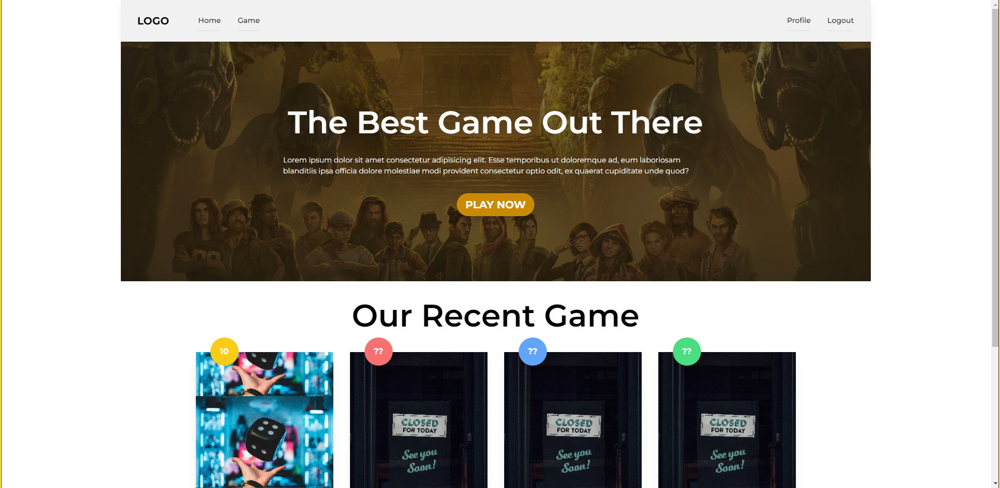

# Overview Challenge Chapter 9

Binar Academy Challenge Chapter 9, created landingpage, login, register, fully functioned suit game to the website with authentication connected with firebase

Deployed Website: [https://chapter-9-team.herokuapp.com/](https://chapter-9-team.herokuapp.com/)

## How to install

Install the node_modules first

`npm install`

## Features

- Authentication
- Login
- Register
- Suit Game
- Game Leaderboard
- Profile

## Screenshot

### Home / Explore

## The Process

### Built With

- React JS
- React Router
- React Context
- Tailwind CSS
- StyledComponents
- Firebase, Firestore, Firebase Authentication

### What We Learned

A Lot

## Continued Development

To the next chapter
